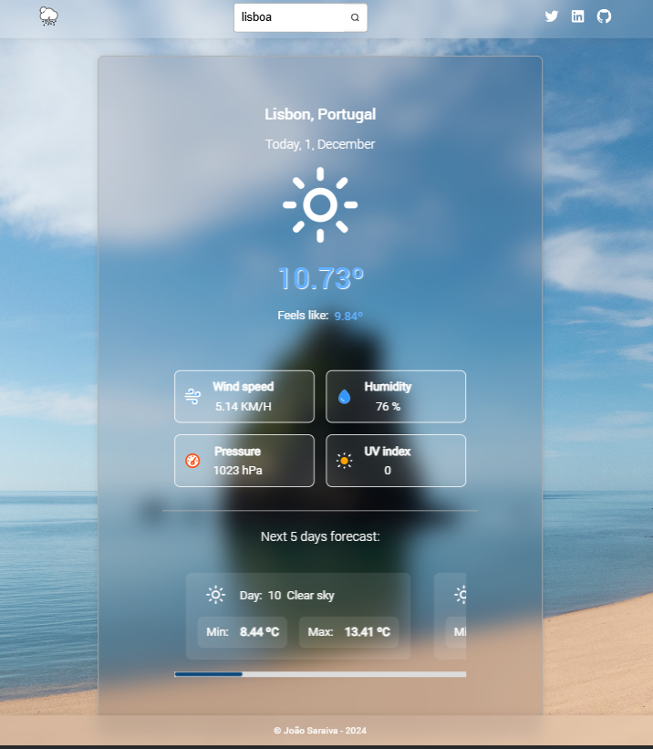
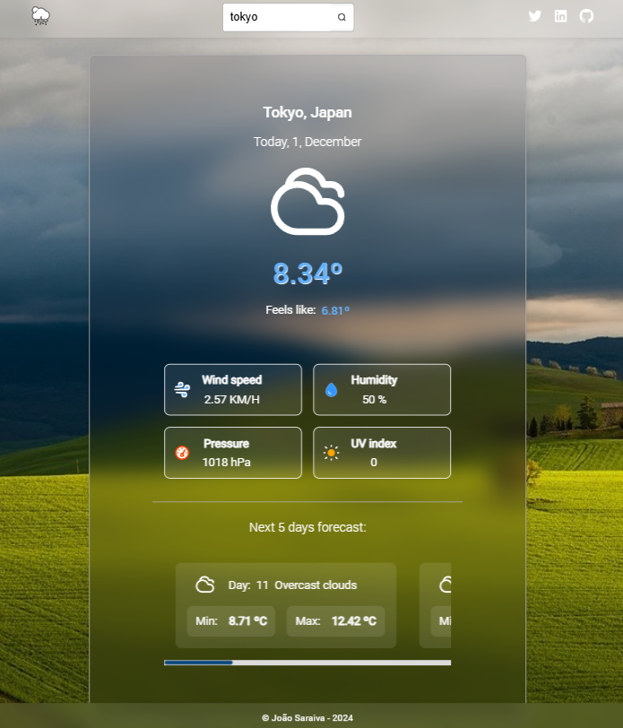

# Weather forecast

## Description:

A minimal full-stack web app that provides accurate weather and location information.
Thanks to a very minimalistic UI, the user can easily check the current weather conditions for any location, such as temperature, wind speed, humidity, pressure, UV index and weather forecast for the next 5 days.

The purpose of this project was mainly to improve my knowledge as a full-stack developer.

A big thank you to [OpenWeather](https://openweathermap.org/api/one-call-3) and [LocationIQ](https://locationiq.com/) to make this possible and so much easier, with their awesome APIs.




## Features:

Responsive UI: A user-friendly interface that works on most devices.
Real-time Weather Data: Displays current weather updates.
Location-based Forecasts: Automatically fetches weather data for the user's location or through manual search.
Backend Integration: The .NET backend handles the API requests that come from the Nuxt frontend

## Technologies:

Frontend: Vue/Nuxt3 with SCSS.
Backend: Dotnet C#
DevOps: Azure DevOps and GithubActions (for learning purposes)

## Execution:

Run the client in the frontend folder, which will be displayed in [localhost](http://localhost:3000/), with the following commands:

```
npm i / pnpm i
npm run dev
```

Run the backend in the backend folder, which will listen on [localhost](http://localhost:80), with the following command (for hot-reload):

```
dotnet watch --run
```

## Contributing

All kinds of contribution are welcome. For major changes, please open an issue first and create the respective pull-request to the main branch.

## Licence

This is an open-source project for learning purposes, which can be used by anyone.
